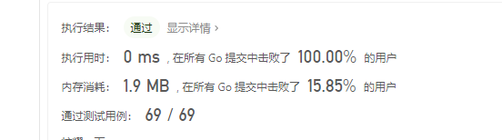

给你二叉树的根节点 root ，返回它节点值的 前序 遍历。

 

示例 ：

输入：root = [1,null,2,3]
输出：[1,2,3]


提示：

树中节点数目在范围 [0, 100] 内
-100 <= Node.val <= 100


作者：力扣 (LeetCode)
链接：https://leetcode-cn.com/leetbook/read/data-structure-binary-tree/xeywh5/


```go
type TreeNode struct {
	Val   int
	Left  *TreeNode
	Right *TreeNode
}

func preorderTraversal(root *TreeNode) []int {
	data := make([]int, 100)
	i := 0
	_preorderTraversal(root, data, &i)
	return data[:i]
}

func _preorderTraversal(node *TreeNode, data []int, i *int) {
	if node != nil {
		data[*i] = node.Val
		*i++
		_preorderTraversal(node.Left, data, i)
		_preorderTraversal(node.Right, data, i)
	}
}

```


